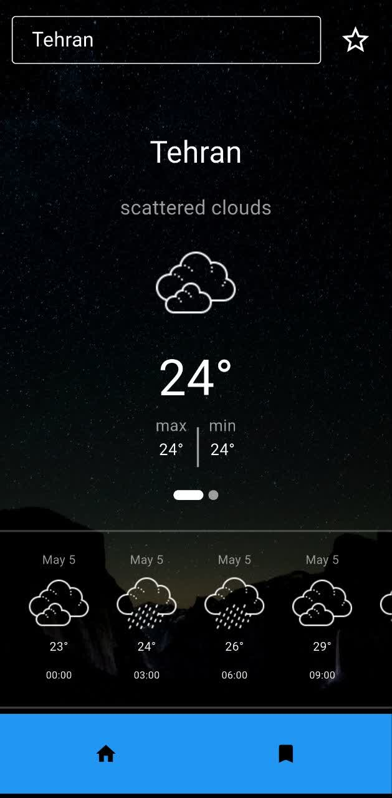
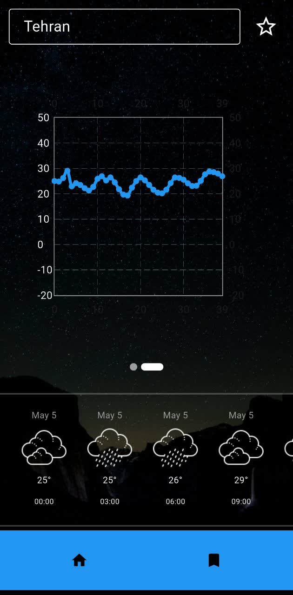
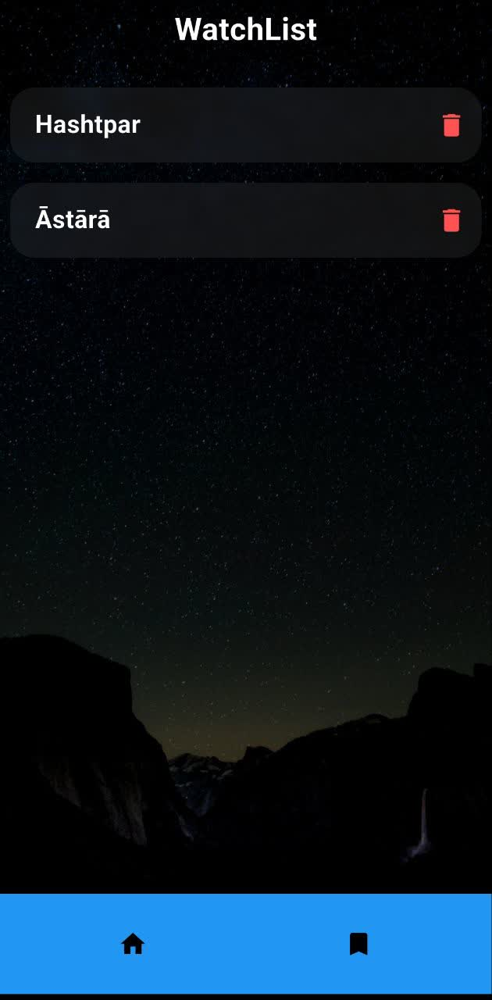

# Weather Program 🌤️



A lightweight, responsive weather app built with **Flutter** and the OpenWeatherMap API. Search for any city, save your favorites, and quickly view current weather details at a glance.

## Features

- **City Search:** Lookup weather by city name (unlimited searches).  
- **Current Conditions:** View temperature (°C), humidity (%), wind speed (m/s), and descriptive conditions (Clear, Clouds, Rain, etc.).  
- **Favorites:** Save your favorite cities and revisit them instantly from the **Saved** tab.  
- **Responsive UI:** Adapts seamlessly to Android, iOS, and web screens.

## Screenshots

  
*Type a city name to fetch its current weather.*

  
*Detailed weather view, including temperature, humidity, wind speed, and a brief description.*

  
*Manage your saved cities and quickly load their weather data.*

## Installation & Setup

1. **Clone the repository**  
   ```bash
   git clone https://github.com/NanoLifeM/Weather_Program.git
   cd Weather_Program

